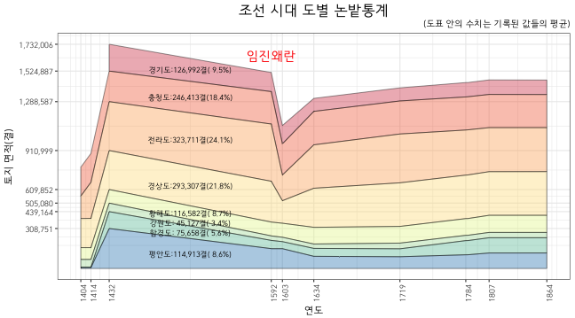

## Problem

조선시대 전답 통계를 stacked area graph로 표시



## Data

```{r, data}
library(knitr)
year <- c(1404, 1414, 1432, 1592, 1603, 1634, 1719, 1784, 1786, 1807, 1864)
province <- c("경기도", "충청도", "전라도", "경상도", "강원도", "황해도", "함경도", "평안도")
field <- matrix(c(NA, 223090, 173990, 224625, 90922, 59989, 3271, 6648,
                  NA, 223090, 279090, 226025, 90925, 59989, 3271, 6648,
                  207119, 236300, 377588, 301147, 104772, 65916, 130413, 308751, 
                  147370, 250503, 442189, 315026, 106832, 34831, 63821, 153009,
                  141959, 240744, 198672, 173902, 108211, 33884, 54377, 153009,
                  100359, 258461, 335305, 301819, 128834, 33884, 61243, 94000,
                  101256, 255208, 377159, 336778, 128834, 44051, 61243, 90804,
                  110932, 255519, 348489, 335730, 129244, 40889, 109556, 105760,
                  109932, 255519, 348489, 336730, 129244, 40889, 109556, 106041,
                  112090, 256528, 340103, 337128, 132211, 41151, 117746, 119635, 
                  111912, 255585, 339743, 337472, 132373, 40926, 117746, 119735), ncol = 8, byrow = TRUE)

rownames(field) <- year
colnames(field) <- province
kable(field)
```
## Reshape

`matrix` (array)에 특화된 `melt` 사용

```{r, reshape}
library(reshape2)
field.melt <- melt(field, varnames = c("Year", "Province"), value.name = "Area")
kable(field.melt)
```

## ggplot

```{r. ggplot, warning = FALSE, fig.width = 9, fig.height = 5}
library(ggplot2)
source("./theme_kr.R")
g0 <- ggplot(data = field.melt, 
             mapping = aes(x = Year, y = Area, fill = Province))
g1 <- g0 +
  geom_area(colour = "black", 
            size = 0.2, 
            alpha = 0.4, 
            na.rm = TRUE) +
  scale_fill_brewer(palette = "Spectral", 
                    breaks = levels(field.melt$Province)) +
  theme.kr
g1
g2<- g1 + 
  scale_x_continuous(name = "연도", 
                     breaks = as.numeric(row.names(field)[-9]),
                     labels = row.names(field)[-9]) +
  theme(axis.text.x = element_text(angle = 90))
g2
g3 <- g2 + 
  scale_y_continuous(name = "토지 면적(결)",
                     breaks = cumsum(field[3, ]),
                     labels = format(cumsum(field[3, ]), big.mark = ","))
g3
```

