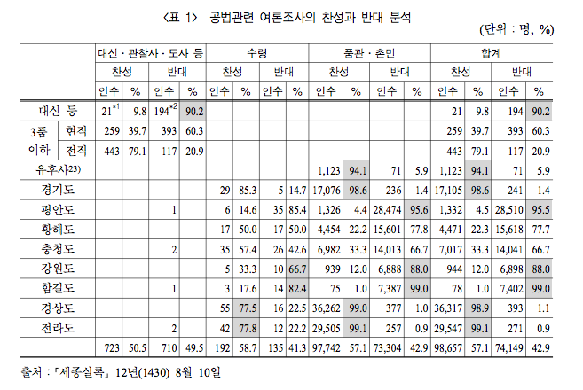

## Data 

원자료는 [세종실록](http://sillok.history.go.kr/id/kda_11208010_005), 요약표는 오기수 교수의 논문에서.



```{r, data, echo = FALSE, message = FALSE, results = 'hide'}
knitr::opts_chunk$set(echo = TRUE)
# library(pander)
library(knitr)
library(ggplot2)
library(grid)
library(gridExtra)
library(extrafont)
# panderOptions('table.split.table', Inf)
load("sejong_poll_data_kr.RData")
str(sejong.poll.kr)
```

```{r, kable, echo = FALSE, results = 'asis'}
v.names.kr <- c("집계", "찬반", "계급", "지역", "관료여부")
# kable(sejong.poll.kr[c(4, 3, 5, 2, 1)])
kable(sejong.poll.kr[c(4, 3, 5, 2, 1)], col.names = v.names.kr[c(4, 3, 5, 2, 1)], align = c(rep('c', 4), 'r'))
```

<!--
<P style = "page-break-before:always">
-->

## 전체 찬반

```{r, overall votes}
# pander(format(tbl.vote, big.mark = ","))
kable(t(as.matrix(format(tbl.vote, 
                         big.mark = ","))), 
      caption = "전체 찬반", align = 'c')
kable(t(as.table(format(tbl.vote, 
                        big.mark = ","))), 
      caption = "전체 찬반", 
      align = 'c')
kable(t(as.table(format(prop.table(tbl.vote)*100, 
                        digits = 3, 
                        nsmall = 1))), 
      caption = "전체 찬반(%)", 
      align = 'c')
```

<P style = "page-break-before:always">

### 원형그래프

```{r, data for pie charts, message = FALSE}
source("./theme_kr.R")
# str(theme.kr)
str(tbl.vote)
kable(t(as.matrix(tbl.vote)))
vote.df <- as.data.frame(tbl.vote)
n.vote <- length(levels(vote.df[, 1]))
# y.coord <- cumsum(vote.df$Freq)/2 + c(0, cumsum(head(vote.df$Freq, -1))/2)
y.coord <- cumsum(vote.df$Freq)
pie.label <- paste(levels(vote.df$vote), 
                   format(vote.df$Freq, 
                          big.mark = ","), 
                   sep = "\n") 
pie.label
kable(vote.df, 
      align = rep("c", 2))
str(vote.df)
```

<P style = "page-break-before:always">

```{r, coord_polar, message = FALSE, fig.width = 3.2, fig.height = 3.2}
p1 <- ggplot(data = vote.df, 
             mapping = aes(x = "", 
                           y = Freq, 
                           fill = vote)) 
p2 <- p1 + 
  geom_bar(width = 1, 
           stat = "identity", 
           position = position_stack(reverse = TRUE))
p2
p2.2 <- p1 + 
  geom_bar(width = 1, 
           stat = "identity", 
           position = "dodge")
p2.2
p3.2 <- p2.2 + 
  theme_bw() + theme.kr
p3.2
p4.2 <- p3.2 + 
  scale_x_discrete(name = "찬반") +
  scale_y_continuous(name = "집계", 
                     breaks = vote.df$Freq, 
                     labels = format(vote.df$Freq, big.mark = ","))
p4.2
```

<P style = "page-break-before:always">

```{r, message = FALSE, fig.width = 3.2, fig.height = 3.2}
p5.2 <- p4.2 +
  scale_fill_manual(name = "찬반", 
                    values = rainbow(n.vote)[n.vote:1], 
                    labels = vote.df$vote)
p5.2
p6.2 <- p5.2 +
  geom_text(aes(y = vote.df$Freq/2), 
            label = format(rev(vote.df$Freq), big.mark = ","), 
#            family = "HCR Dotum LVT", 
            position = position_dodge(width = 1))
p6.2
```

<P style = "page-break-before:always">

```{r, message = FALSE, fig.width = 3.2, fig.height = 3.2}
p7.2 <- p6.2 +
  theme(legend.position = c(0.75, 0.85))
p7.2
p8.2 <- p5.2 +
  guides(fill = "none") +
  geom_text(aes(y = vote.df$Freq/2),
            family = "HCR Dotum LVT", 
            label = rev(pie.label),
            position = position_dodge(width = 1))
p8.2
# ggsave("../pics/sejong_geom_bar_total_ggplot.png", p7.2, dpi = 72)
```

<P style = "page-break-before:always">

```{r, message = FALSE, fig.width = 3.2, fig.height = 3.2}
p3 <- p2 + 
  theme_bw() + theme.kr
p3 
p4 <- p3 + 
  scale_x_discrete(name = "찬반") +
  scale_y_continuous(name = "집계", 
                     breaks = y.coord, 
                     labels = format(y.coord, big.mark = ","))
p4
```

<P style = "page-break-before:always">

```{r, message = FALSE, fig.width = 3.2, fig.height = 3.2}
p5 <- p4 +
  scale_fill_manual(name = "찬반", values = rainbow(2)[2:1], labels = vote.df$vote)
p5
p6 <- p5 + 
  geom_text(aes(y = y.coord/2), 
            label = format(vote.df$Freq, big.mark = ","), 
#            family = "HCR Dotum LVT", 
            position = position_stack(reverse = TRUE))  
p6
# ggsave("../pics/sejong_geom_bar_total_ggplot_stack.png", p6, dpi = 72)
```

<P style = "page-break-before:always">

```{r, message = FALSE, fig.width = 3.2, fig.height = 3.2}
p7 <- p6 +
  theme(legend.position = c(0.2, 0.75))
p7
p8 <- p5 + 
  guides(fill = "none") +
  geom_text(aes(y = y.coord/2),
            label = pie.label,
            family = "HCR Dotum LVT", 
            position = position_stack(reverse = TRUE))
p8
pie.total.1 <- p2 + 
  coord_polar(theta = "y", 
              start = 3 * pi /2 , 
              direction = -1)
pie.total.1
pie.total.2 <- pie.total.1 + 
  scale_y_continuous(name = "", 
                     breaks = NULL) +
  scale_x_discrete(name = "") 
pie.total.2
```

<P style = "page-break-before:always">

```{r, message = FALSE, fig.width = 3.2, fig.height = 3.2}
pie.total.3 <- pie.total.2 +
  scale_fill_manual(name = "", 
                    values = rainbow(n.vote)[n.vote:1])
pie.total.3
pie.total.4 <- pie.total.3 +
  theme_void(base_family = "HCR Dotum LVT")
pie.total.4
```

<P style = "page-break-before:always">

```{r, message = FALSE, fig.width = 3.2, fig.height = 3.2}
pie.total.5 <- pie.total.4 +
  guides(fill = "none")
pie.total.5
pie.total.6 <- pie.total.5 +
#  geom_text(aes(y = y.coord), label = pie.label, family = "HCR Dotum LVT")
  geom_text(aes(y = y.coord/2), 
            label = pie.label, 
            family = "HCR Dotum LVT", 
            position = position_stack(reverse = TRUE))
pie.total.6
```

<P style = "page-break-before:always">

```{r, message = FALSE, fig.width = 7, fig.height = 7}
pie.total.7 <- pie.total.6 +
  ggtitle("전체 찬반") +
  theme(plot.margin = unit(c(1, 1, 1.5, 1), "lines"), plot.title = element_text(hjust = 0.5))
pie.total.7
# ggsave("../pics/sejong_total_pie_ggplot.png", pie.total.7, dpi = 72)
```

<P style = "page-break-before:always">

#### `pie.gg()`

```{r, pie.gg, fig.width = 3.2, fig.height = 3.2}
pie.gg <- function(df, ggtitle = "", font.family = ""){
  n <- length(names(df))
  y.coord <- cumsum(df$Freq)
  pie.label <- paste(levels(df$vote), format(df$Freq, big.mark = ","), 
                     sep = "\n") 
  p1 <- ggplot(df, aes(x = "", 
                       y = Freq, 
                       fill = vote)) 
  p2 <- p1 + 
    geom_bar(width = 1, 
             stat = "identity", 
             position = position_stack(reverse = TRUE))
  pie.1 <- p2 + 
    coord_polar(theta = "y", 
                start = 3 * pi / 2, 
                direction = -1)
  pie.2 <- pie.1 + 
    scale_y_continuous(name = "", 
                       breaks = NULL) +
    scale_x_discrete(name = "") 
  pie.3 <- pie.2 +
    scale_fill_manual(name = "", 
                      values = rainbow(n)[n:1])
  pie.4 <- pie.3 +
    theme_void(base_family = font.family)
  pie.5 <- pie.4 +
    guides(fill = "none")
  pie.6 <- pie.5 +
    geom_text(aes(y = y.coord/2), 
              label = pie.label, 
              family = font.family, 
              position = position_stack(reverse = TRUE))
  pie.7 <- pie.6 +
    ggtitle(ggtitle) + 
    theme(plot.margin = unit(c(1, 1, 1.5, 1), "lines"), 
          plot.title = element_text(hjust = 0.5))
  return(pie.7)
}
dump("pie.gg", 
     file = "./pie.gg.R")
```

<P style = "page-break-before:always">

```{r, message = FALSE, fig.width = 7, fig.height = 7}
pie.gg(vote.df, 
       ggtitle = "전체 찬반", 
       font.family = "HCR Dotum LVT")
```

<P style = "page-break-before:always">

# 계급 및 지역별 찬반

## 계급별 찬반

```{r, vote by classes}
kable(format(vote.class, 
             big.mark = ","), 
      align = "r", 
      caption = "계급별 찬반")
kable(format(prop.table(vote.class, 
                        margin = 2)*100, 
             digits = 3, 
             nsmall = 1), 
      align = "r", 
      caption = "계급별 찬반(%)")
```

## 품관촌민 별도 분석

품관촌민의 수효가 상대적으로 많아서

```{r, vote by class2}
kable(format(vote.class.2, 
             big.mark = ","), 
      align = rep("r", 2), 
      caption = "품관촌민")
```

소계를 교차표의 주변에 계산

```{r, addmargins}
kable(format(vote.class.2.am, 
             big.mark = ","), 
      caption = "관료와 품관촌민(소계)", 
      align = rep("r", 3))
```

백분율을 계산하여 주변에 집계. 

```{r, Percentage}
kable(format(prop.table(vote.class.2, 
                        margin = 2)*100, 
             digits = 3, nsmall = 1), 
      caption = "관료와 품관촌민(%)", 
      align = rep("r", 3))
```

### data frame 변환

```{r, message = FALSE}
vote.class.2.df <- as.data.frame(vote.class.2)
v.names.class.kr <- c("찬반", "계급", "집계")
kable(format(vote.class.2.df, 
             big.mark = ","), 
      align = c('c', 'c', 'r'), 
      col.names = v.names.class.kr, 
      caption = "관료와 품관촌민")
vote.bureaus.df <- subset(vote.class.2.df, 
                          vote.class.2.df$class.2 == "관료", 
                          select = c("vote", "Freq"))
kable(format(vote.bureaus.df, 
             big.mark = ","), 
      align = 'r', 
      col.names = v.names.class.kr[-2], 
      caption = "관료의 찬반")
vote.commons.df <- subset(vote.class.2.df, 
                          vote.class.2.df$class.2 == "품관촌민", 
                          select = c("vote", "Freq"))
kable(format(vote.commons.df, 
             big.mark = ","), 
      align = 'r', 
      row.names = FALSE, 
      col.names = v.names.class.kr[-2], 
      caption = "품관촌민의 찬반")
```

<P style = "page-break-before:always">

### 원형그래프

```{r, coord_polar.2, message = FALSE, fig.width = 8, fig.height = 4}
pie.bureaus <- pie.gg(vote.bureaus.df, 
                      ggtitle = "관료의 찬반", 
                      font.family = "HCR Dotum LVT")
pie.commons <- pie.gg(vote.commons.df, 
                      ggtitle = "품관촌민의 찬반", 
                      font.family = "HCR Dotum LVT")
pies.grid <- grid.arrange(pie.bureaus, 
                          pie.commons, 
                          ncol = 2, 
                          top = "")
pies.grid
# ggsave("../pics/sejong_bureaus_commons_pie_ggplot.png", pies.grid, width = 8, height = 4, dpi = 72)
```
<P style = "page-break-before:always">

## 지역별 찬반

### 관료와 품관촌민

```{r, by region}
kable(vote.region.bureaus, 
      caption = "관료들의 지역별 찬반")
kable(format(prop.table(vote.region.bureaus, 
                        margin = 2) * 100, 
             digits = 3, 
             nsmall = 1), 
      align = rep("r", 9), 
      caption = "관료들의 지역별 찬반(%)")
kable(format(vote.region.commons, 
             big.mark = ","), 
      align = rep("r", 9), 
      caption = "품관촌민들의 지역별 찬반")
kable(format(prop.table(vote.region.commons, 
                        margin = 2) * 100, 
             digits = 1, 
             nsmall = 1), 
      align = rep("r", 9), 
      caption = "품관촌민들의 지역별 찬반(%)")
```

## 서울의 찬반

```{r, Seoul}
kable(vote.seoul.class, 
      caption = "서울의 찬반")
kable(format(prop.table(vote.seoul.class, 
                        margin = 2) * 100, 
             digits = 1, 
             nsmall = 1), 
      align = rep("r", 3), 
      caption = "서울의 찬반(%)")
```

<P style = "page-break-before:always">

### 막대그래프

##### Stack

```{r, seoul geom_bar stack, fig.width = 6, fig.height = 4.5}
vote.seoul.df <- as.data.frame(vote.seoul.class)
n.fill <- length(levels(vote.seoul.df[, 1]))
x.stack <- vote.seoul.df[, 2]
y.stack <- unlist(tapply(vote.seoul.df$Freq, 
                         vote.seoul.df$class, 
                         function(x){x / 2 + 
                             c(0, cumsum(head(x, -1)))}))
# y.stack <- unlist(tapply(vote.seoul.df$Freq, 
#                         vote.seoul.df$class, 
#                         cumsum))
b1.seoul <- ggplot(vote.seoul.df, 
                   aes(x = x.stack, 
                       y = Freq, 
                       fill = vote)) +
  geom_bar(stat = "identity", 
           position = position_stack(reverse = TRUE))
b1.seoul
b2.seoul <- b1.seoul +
  theme_bw(base_family = "HCR Dotum LVT") +
  theme.kr +
  scale_x_discrete(name = "계급") +
  scale_y_continuous(name = "집계", 
                     breaks = y.stack, 
                     labels = y.stack) +
  scale_fill_manual(name = "찬반", 
                    values = rainbow(n.fill)[n.fill:1], 
                    labels = vote.seoul.df$vote)
b2.seoul  
```

<P style = "page-break-before:always">

```{r, fig.width = 6, fig.height = 4.5}
b3.seoul <- b2.seoul +
# geom_text(aes(y = y.stack/2), label = vote.seoul.df$Freq)
  geom_text(aes(y = y.stack), 
            label = vote.seoul.df$Freq, 
            position = "identity")
b3.seoul
# ggsave("../pics/sejong_seoul_barplot_stack_ggplot.png", b3.seoul, width = 6, height = 4.5, dpi = 72)
```

<P style = "page-break-before:always">

#### Dodge

```{r, seoul geom_bar dodge, fig.width = 6, fig.height = 4.5}
n.fill <- length(levels(vote.seoul.df[, 1]))
b1.seoul.dodge <- ggplot(vote.seoul.df, 
                         aes(x = x.stack, 
                             y = Freq, 
                             fill = vote)) +
  geom_bar(stat = "identity", position = "dodge")
b1.seoul.dodge
```

<P style = "page-break-before:always">

```{r, fig.width = 6, fig.height = 4.5}
b2.seoul.dodge <- b1.seoul.dodge +
  theme_bw(base_family = "HCR Dotum LVT") +
  theme.kr +
  scale_x_discrete(name = "계급") +
  scale_y_continuous(name = "집계", 
                     breaks = vote.seoul.df$Freq, 
                     labels = vote.seoul.df$Freq) +
  scale_fill_manual(name = "찬반", 
                    values = rainbow(n.fill)[n.fill:1], 
                    labels = vote.seoul.df$vote)
b2.seoul.dodge  
```

<P style = "page-break-before:always">

```{r, fig.width = 6, fig.height = 4.5}
#  N <- nrow(vote.seoul.df)
#  index <- as.vector(matrix(1:N, nrow = 2)[2:1, ])
y.label <- unlist(tapply(vote.seoul.df$Freq, 
                                 vote.seoul.df$class,
                                 rev))
b3.seoul.dodge <- b2.seoul.dodge +
  geom_text(aes(y = vote.seoul.df$Freq/2), 
#            label = vote.seoul.df[index, "Freq"], 
            label = y.label,
            position = position_dodge(width = 0.9)) +
  ggtitle("서울의 찬반")
b3.seoul.dodge
# ggsave("../pics/sejong_seoul_barplot_dodge_ggplot.png", b3.seoul.dodge, width = 6, height = 4.5, dpi = 72)
```

<P style = "page-break-before:always">

#### Fill

```{r, seoul geom_bar fill, fig.width = 6, fig.height = 4.5}
n.fill <- length(levels(vote.seoul.df[, 1]))
y.fill <- unlist(tapply(vote.seoul.df$Freq, 
                        x.stack, 
                        function(x){cumsum(x)/sum(x)}))
p.fill <- unlist(tapply(vote.seoul.df$Freq, 
                        x.stack, 
                        function(x){(x / 2 + c(0, cumsum(head(x, -1))))/sum(x)}))
b1.seoul.fill <- ggplot(vote.seoul.df, 
                        aes(x = x.stack, 
                            y = Freq, 
                            fill = vote)) +
  geom_bar(stat = "identity", 
           position = position_fill(reverse = TRUE))
b1.seoul.fill
```

<P style = "page-break-before:always">

```{r, fig.width = 6, fig.height = 4.5}
b2.seoul.fill <- b1.seoul.fill +
  theme_bw(base_family = "HCR Dotum LVT") +
  theme.kr +
  scale_x_discrete(name = "계급") +
  scale_y_continuous(name = "집계(%)", 
                     breaks = y.fill, 
                     labels = format(y.fill * 100, 
                                     digits = 2, 
                                     nsmall = 1)) +
  scale_fill_manual(name = "찬반", 
                    values = rainbow(n.fill)[n.fill:1], 
                    labels = vote.seoul.df$vote)
b2.seoul.fill  
```

<P style = "page-break-before:always">

```{r, fig.width = 6, fig.height = 4.5}
b3.seoul.fill <- b2.seoul.fill +
  geom_text(aes(y = p.fill), 
            label = vote.seoul.df$Freq, 
            position = "identity") +
  ggtitle("서울의 찬반")
b3.seoul.fill
# ggsave("../pics/sejong_seoul_barplot_fill_ggplot.png", b3.seoul.fill, width = 6, height = 4.5, dpi = 72)
```

<P style = "page-break-before:always">

### barplot.gg

#### Stack 

```{r, stack}
barplot.gg.stack <- function(df, 
                             base_family = "", 
                             ggtitle = "", 
                             xlab = "", 
                             ylab = "", 
                             fill.name = ""){
n.fill <- length(levels(df[, 1]))
x <- df[, 2]
y <- unlist(tapply(df$Freq, 
                   x, 
                   function(x){x / 2 + c(0, cumsum(head(x, -1)))}))
y.breaks <- y
# delta <- (max(y.breaks) - min(y.breaks)) / 20
# y.breaks.sort <- sort(y.breaks)
# diff(y.breaks.sort) < delta 
# index <- which(diff(y.breaks.sort)  > delta)
# y.breaks <- c(0, y.breaks.sort[c(index, length(y.breaks.sort))])
y.label <- format(y.breaks, big.mark = ",")
b1 <- ggplot(df, 
             aes(x = x, 
                 y = Freq, 
                 fill = vote)) +
  geom_bar(stat = "identity", 
           position = position_stack(reverse = TRUE))
b2 <- b1 +
  theme_bw(base_family = base_family) +
#  theme.kr +
  scale_x_discrete(name = xlab) +
  scale_y_continuous(name = ylab, 
                     breaks = y.breaks,
                     labels = y.label) +
  scale_fill_manual(name = fill.name, 
                    values = rainbow(n.fill)[n.fill:1], 
                    labels = df$vote, 
                    guide = guide_legend())
b3 <- b2 +
  geom_text(aes(y = y), 
            label = format(df$Freq, 
                           big.mark = ","), 
            position = "identity") +
  ggtitle(ggtitle)
return(b3)
}
```

<P style = "page-break-before:always">

#### Dodge

```{r, dodge}
barplot.gg.dodge <- function(df, 
                             base_family = "", 
                             ggtitle = "", 
                             xlab = "", 
                             ylab = "", 
                             fill.name = ""){
n.fill <- length(levels(df[, 1]))
x <- df[, 2]
y.dodge <- df$Freq
b1 <- ggplot(df, 
             aes(x = x, 
                 y = Freq, 
                 fill = vote)) +
  geom_bar(stat = "identity", 
           position = "dodge")
b2 <- b1 +
  theme_bw(base_family = base_family) +
#  theme.kr +
  scale_x_discrete(name = xlab) +
  scale_y_continuous(name = ylab, 
                     breaks = y.dodge,
                     labels = format(y.dodge, big.mark = ",")) +
  scale_fill_manual(name = fill.name, 
                    values = rainbow(n.fill)[n.fill:1], 
                    labels = df$vote)
#  N <- nrow(df)
#  index <- as.vector(matrix(1:N, nrow = 2)[2:1, ])
y.label <- unlist(tapply(df$Freq, 
                         df[, 2],
                         rev))
b3 <- b2 +
  geom_text(aes(y = y.dodge/2), 
#            label = format(df[index, "Freq"], big.mark = ","), 
            label = y.label,
            position = position_dodge(width = 0.9)) +
  ggtitle(ggtitle)
return(b3)
}
```

<P style = "page-break-before:always">

#### Fill

```{r, fill}
barplot.gg.fill <- function(df, 
                            base_family = "", 
                            ggtitle = "", 
                            xlab = "", 
                            ylab = "", 
                            fill.name = ""){
n.fill <- length(levels(df[, 1]))
x <- df[, 2]
y.fill <- unlist(tapply(df$Freq, 
                   x, 
                   function(x){cumsum(x)/sum(x)}))
p.fill <- unlist(tapply(df$Freq, 
                        x, 
                        function(x){(x / 2 + c(0, cumsum(head(x, -1))))/sum(x)}))
b1 <- ggplot(df, 
             aes(x = x, 
                 y = Freq, 
                 fill = vote)) +
  geom_bar(stat = "identity", 
           position = position_fill(reverse = TRUE))
b2 <- b1 +
  theme_bw(base_family = base_family) +
#  theme.kr +
  scale_x_discrete(name = xlab) +
  scale_y_continuous(name = ylab, 
                     breaks = y.fill,
                     labels = format(y.fill * 100,
                                     digits = 2,
                                     nsmall = 1)) +
  scale_fill_manual(name = fill.name, 
                    values = rainbow(n.fill)[n.fill:1], 
                    labels = df$vote, 
                    guide = guide_legend())
b3 <- b2 +
  geom_text(aes(y = p.fill), 
            label = format(df$Freq, big.mark = ","), 
            position = "identity") +
  ggtitle(ggtitle)
return(b3)
}
```

<P style = "page-break-before:always">

#### barplot.gg

```{r, barplot.gg, message = FALSE}
barplot.gg <- function(x, 
                       position, 
                       base_family = "", 
                       ggtitle = "", 
                       xlab = "", 
                       ylab = "", 
                       fill.name = ""){
  switch(position,
         stack = barplot.gg.stack(x, 
                                  base_family = base_family, 
                                  ggtitle = ggtitle, 
                                  xlab = xlab, 
                                  ylab = ylab, 
                                  fill.name = fill.name),
         dodge = barplot.gg.dodge(x, 
                                  base_family = base_family, 
                                  ggtitle = ggtitle, 
                                  xlab = xlab, 
                                  ylab = ylab, 
                                  fill.name = fill.name),
         fill = barplot.gg.fill(x, 
                                base_family = base_family, 
                                ggtitle = ggtitle, 
                                xlab = xlab, 
                                ylab = ylab, 
                                fill.name = fill.name))
}
```

<P style = "page-break-before:always">

```{r, seoul_stack, fig.width = 6, height = 4.5}
(bar_seoul_stack <- barplot.gg(vote.seoul.df, 
                               position = "stack", 
                               base_family = "HCR Dotum LVT", 
                               ggtitle = "서울의 찬반", 
                               xlab = "계급", 
                               ylab = "집계", 
                               fill.name = "찬반"))
# ggsave("../pics/sejong_seoul_barplot_stack_ggplotv2.png", bar_seoul_stack, width = 6, height = 4.5, dpi = 72)
```

<P style = "page-break-before:always">

```{r, seoul_dodge, fig.width = 6, height = 4.5}
(bar_seoul_dodge <- barplot.gg(vote.seoul.df, 
                               position = "dodge", 
                               base_family = "HCR Dotum LVT", 
                               ggtitle = "서울의 찬반", 
                               xlab = "계급", 
                               ylab = "집계", 
                               fill.name = "찬반"))
# ggsave("../pics/sejong_seoul_barplot_dodge_ggplotv2.png", bar_seoul_dodge, width = 6, height = 4.5, dpi = 72)
```

<P style = "page-break-before:always">

```{r, seoul_fill, fig.width = 6, height = 4.5}
(bar_seoul_fill <- barplot.gg(vote.seoul.df, 
                              position = "fill", 
                              base_family = "HCR Dotum LVT", 
                              ggtitle = "서울의 찬반", 
                              xlab = "계급", 
                              ylab = "집계(%)", 
                              fill.name = "찬반"))
# ggsave("../pics/sejong_seoul_barplot_fill_ggplotv2.png", bar_seoul_fill, width = 6, height = 4.5, dpi = 72)
dump(c("barplot.gg","barplot.gg.stack", "barplot.gg.dodge", "barplot.gg.fill"), 
     file = "./barplot.gg.R")
```

<P style = "page-break-before:always">

### mosaic plot

#### Data

```{r, message = FALSE}
vote.seoul.class.df <- as.data.frame(vote.seoul.class)
vote.seoul.class.sum <- tapply(vote.seoul.class.df$Freq, 
                               vote.seoul.class.df[, 2], 
                               sum)
vote.seoul.class.p.m <- prop.table(vote.seoul.class.sum)
vote.seoul.class.p <- prop.table(vote.seoul.class)
vote.seoul.class.p.2 <- prop.table(vote.seoul.class, 
                                   margin = 2)
vote.seoul.class.p.df <- as.data.frame(vote.seoul.class.p)
vote.seoul.class.p.df$width <- vote.seoul.class.p.m[match(vote.seoul.class.p.df$class, 
                                                          names(vote.seoul.class.p.m))]
vote.seoul.class.p.2.df <- as.data.frame(vote.seoul.class.p.2)
vote.seoul.class.p.df$height <- vote.seoul.class.p.2.df$Freq
vote.seoul.class.p.df$label.height <- unlist(tapply(vote.seoul.class.p.df$height,
                                                    vote.seoul.class.p.df$class, 
                                                    cumsum))
x.center <- (cumsum(vote.seoul.class.p.m) + 
               c(0, head(cumsum(vote.seoul.class.p.m), -1)))/2
vote.seoul.class.p.df$center <- x.center[match(vote.seoul.class.p.df$class, 
                                               names(x.center))]
```

<P style = "page-break-before:always">

```{r, mosaic plot for seoul ggplot, fig.width = 6, fig.height = 4.5}
m1 <- ggplot(vote.seoul.class.p.df, 
             aes(x = center, 
                 y = height, 
                 width = width)) + 
  geom_bar(aes(fill = vote), 
           stat = "identity", 
           col = "white", 
           size = 2, 
           position = position_stack(reverse = TRUE))
m1
```

<P style = "page-break-before:always">

```{r, fig.width = 6, fig.height = 4.5}
m2 <- m1 + 
  theme_bw(base_family = "HCR Dotum LVT")
m2
```

<P style = "page-break-before:always">

```{r, fig.width = 6, fig.height = 4.5}
m3 <- m2 + 
  geom_text(aes(x = center, 
                y = 1.05), 
            label = vote.seoul.class.p.df$class, 
            family = "HCR Dotum LVT")
m3
```

<P style = "page-break-before:always">

```{r, fig.width = 6, fig.height = 4.5}
m4 <- m3 + 
  geom_text(aes(x = center, 
                y = label.height/2), 
            label = format(vote.seoul.class.df$Freq, 
                           big.mark = ","), 
            position = position_stack(reverse = TRUE))
m4
```

<P style = "page-break-before:always">

```{r, fig.width = 6, fig.height = 4.5}
x.breaks <- c(0, ifelse(cumsum(vote.seoul.class.p.m) < 0.1, 0.0, cumsum(vote.seoul.class.p.m)))
x.label <- format(x.breaks * 100, 
                  digits = 3, 
                  nsmall = 1)
y.breaks <- vote.seoul.class.p.df$label.height
delta <- (max(y.breaks) - min(y.breaks)) / 20
y.breaks.sort <- sort(y.breaks)
index <- which(diff(y.breaks.sort)  > delta)
y.breaks <- c(0, y.breaks.sort[c(index, length(y.breaks.sort))])
y.label <- format(y.breaks * 100,
                  digits = 2,
                  nsmall = 1)
m5 <- m4 + 
  scale_x_continuous(name = "계급(누적 %)", 
                     breaks = x.breaks, 
                     label = x.label) + 
  scale_y_continuous(name = "찬반(%)",
                     breaks = y.breaks,
                     label = y.label) + 
  scale_fill_manual(name = "찬반", 
                    values = rainbow(2)[2:1], 
                    labels = rev(vote.seoul.df$vote), 
                    guide = guide_legend()) +
  ggtitle("서울의 찬반")
m5
```

<!--
<P style = "page-break-before:always">
-->

#### mosaic_gg

```{r mosaic_gg, fig.width = 6, fig.height = 4.5}
mosaic_gg <- function(tbl, base_family = "", 
                      ggtitle = "", 
                      xlab = "", 
                      ylab = "", 
                      fill.name = ""){
tbl.df <- as.data.frame(tbl)
tbl.sum <- tapply(tbl.df$Freq, tbl.df[, 2], sum)
tbl.p.m <- prop.table(tbl.sum)
tbl.p <- prop.table(tbl)
tbl.p.2 <- prop.table(tbl, margin = 2)
tbl.p.df <- as.data.frame(tbl.p)
tbl.p.df$width <- tbl.p.m[match(tbl.p.df[, 2], names(tbl.p.m))]
tbl.p.df$height <- as.data.frame(tbl.p.2)$Freq
tbl.p.df$label.height <- unlist(tapply(tbl.p.df$height, tbl.p.df[, 2], cumsum))
x.center <- (cumsum(tbl.p.m) + c(0, head(cumsum(tbl.p.m), -1)))/2
tbl.p.df$center <- x.center[match(tbl.p.df[, 2], names(x.center))]
m1 <- ggplot(tbl.p.df, aes(x = center, y = height, width = width)) + 
  geom_bar(aes(fill = vote), 
           stat = "identity", 
           col = "white", 
           size = 1, 
           position = position_stack(reverse = TRUE)) 
m2 <- m1 + 
  theme_bw(base_family = base_family)
m3 <- m2 + 
  geom_text(aes(x = center, y = 1.05), 
            label = tbl.p.df[, 2], 
            family = base_family)
m4 <- m3 + 
  geom_text(aes(x = center, y = label.height/2), 
            label = format(tbl.df$Freq, big.mark = ","), 
            position = position_stack(reverse = TRUE))
x.breaks <- c(0, ifelse(cumsum(tbl.p.m) < 0.1, 0.0, cumsum(tbl.p.m)))
x.label <- format(x.breaks * 100, 
                  digits = 3, 
                  nsmall = 1)
y.breaks <- tbl.p.df$label.height
# delta <- (max(y.breaks) - min(y.breaks)) / 20
# y.breaks.sort <- sort(y.breaks)
# diff(y.breaks.sort) < delta 
# index <- which(diff(y.breaks.sort)  > delta)
# y.breaks <- c(0, y.breaks.sort[c(index, length(y.breaks.sort))])
y.label <- format(y.breaks * 100,
                  digits = 2,
                  nsmall = 1)
m5 <- m4 + 
  scale_x_continuous(name = xlab, 
                     breaks = x.breaks, 
                     label = x.label) + 
  scale_y_continuous(name = ylab,
                     breaks = y.breaks,
                     label = y.label) + 
  scale_fill_manual(name = fill.name, 
                    values = rainbow(2)[2:1], 
                    labels = tbl.df$vote, 
                    guide = guide_legend()) +
  ggtitle(ggtitle) +
  theme(plot.margin = unit(c(1, 2, 1, 1), "lines"))
return(m5)
}
dump(list = "mosaic_gg", file = "./mosaic_gg.R")
```

<!--
<P style = "page-break-before:always">
-->

```{r, message = FALSE, fig.width = 6, fig.height = 4.5}
m5.seoul <- mosaic_gg(vote.seoul.class, 
                      base_family = "HCR Dotum LVT", 
                      ggtitle = "서울의 찬반", 
                      xlab = "계급", 
                      ylab = "찬반", 
                      fill.name = "찬반")
m5.seoul
# ggsave("../pics/sejong_seoul_mosaic_ggplot.png", m5.seoul, width = 6, height = 4.5, dpi = 72)
```

<P style = "page-break-before:always">

## 지역별 관료들의 찬반(서울 제외)

```{r, local bureaus}
kable(vote.region.bureaus[, -1], 
      caption = "지역별 관료들의 찬반(서울 제외)")
kable(format(prop.table(vote.region.bureaus[, -1], 
                        margin = 2)*100, 
             digits = 1, 
             nsmall = 1), 
      align = "r", 
      caption = "지역별 관료들의 찬반(서울 제외, %)")
```

<P style = "page-break-before:always">

### 막대그래프

```{r, geom_bar for regional bureaus, fig.width = 9, fig.height = 4.5}
vote.region.bureaus.df <- as.data.frame(vote.region.bureaus[, -1])
barplot.gg(vote.region.bureaus.df, 
           position = "stack", 
           base_family = "HCR Dotum LVT", 
           ggtitle = "지방 관료들의 찬반", 
           xlab = "지역", 
           ylab = "집계", 
           fill.name = "찬반")
# ggsave("../pics/sejong_bureaus_barplot_stack_ggplot.png", width = 9, height = 4.5, dpi = 72)
```

<P style = "page-break-before:always">

### mosaic plot

```{r, mosaic plot for region ggplot, fig.width = 9, fig.height = 4.5}
# source("./mosaic.gg.R")
m5.bureaus <- mosaic_gg(vote.region.bureaus[, -1], 
                        base_family = "HCR Dotum LVT", 
                        ggtitle = "지방관료의 찬반", 
                        xlab = "지역별 관료들의 비중(누적 %)", 
                        ylab = "찬반(%)", 
                        fill.name = "찬반")
m5.bureaus
# ggsave("../pics/sejong_bureaus_mosaic_ggplot.png", m5.bureaus, width = 9, height = 4.5, dpi = 72)
```

<P style = "page-break-before:always">

## 품관촌민들의 지역별 찬반

### 막대그래프

```{r, geom_bar for commons, fig.width = 10, fig.height = 4.5}
vote.region.commons.df <- as.data.frame(vote.region.commons)
barplot.gg(vote.region.commons.df, 
           position = "stack", 
           base_family = "HCR Dotum LVT", 
           ggtitle = "품관촌민의 찬반", 
           xlab = "지역", 
           ylab = "집계", 
           fill.name = "찬반")
# ggsave("../pics/sejong_commons_barplot_stack_ggplot.png", width = 9, height = 4.5, dpi = 72)
```

<P style = "page-break-before:always">

### mosaic plot

```{r, mosaic plot for commons ggplot, fig.width = 12, fig.height = 4.5}
# source("./mosaic.gg.R")
m5.commons <- mosaic_gg(vote.region.commons, 
                        base_family = "HCR Dotum LVT", 
                        ggtitle = "품관촌민의 찬반", 
                        xlab = "지역별 품관촌민의 비중(누적%)", 
                        ylab = "찬반(%)", 
                        fill.name = "찬반")
m5.commons
# ggsave("../pics/sejong_commons_mosaic_ggplot.png", m5.commons, width = 12, height = 4.5, dpi = 72)
```

<P style = "page-break-before:always">

## 충청도

관료들의 찬반과 품관촌민의 찬반이 다른 곳.

```{r, chungcheong}
kable(format(vote.chung.class, 
             big.mark = ","), 
      caption = "충청도 사례", 
      align = "r")
kable(format(prop.table(vote.chung.class, 
                        margin = 2)*100, 
             digits = 3, nsmall = 1), 
      caption = "충청도 사례", 
      align = "r")
```

### 막대그래프

```{r, geom_bar fill for Chungcheong, fig.width = 6, fig.height = 4.5}
vote.chung.class.df <- as.data.frame(vote.chung.class)
barplot.gg(vote.chung.class.df, 
           position = "fill", 
           base_family = "HCR Dotum LVT", 
           ggtitle = "충청도의 찬반", 
           xlab = "계급", 
           ylab = "집계(%)", 
           fill.name = "찬반")
# ggsave("../pics/sejong_chungcheong_barplot_fill_ggplot.png", width = 6, height = 4.5, dpi = 72)
```

<P style = "page-break-before:always">

### mosaic plot

```{r, mosaic plot for chungcheong ggplot, fig.width = 12, fig.height = 4.5}
# source("./mosaic.gg.R")
m5.chungcheong <- mosaic_gg(vote.chung.class[, -1], 
                            base_family = "HCR Dotum LVT", 
                            ggtitle = "충청도의 찬반", 
                            xlab = "계급(누적%)", 
                            ylab = "찬반(%)", 
                            fill.name = "찬반")
m5.chungcheong
# ggsave("../pics/sejong_chungcheong_mosaic_ggplot.png", m5.chungcheong, width = 12, height = 4.5, dpi = 72)
```

## 자료 정리

```{r, save}
save.image(file = "./sejong_ggplot.RData")
```

