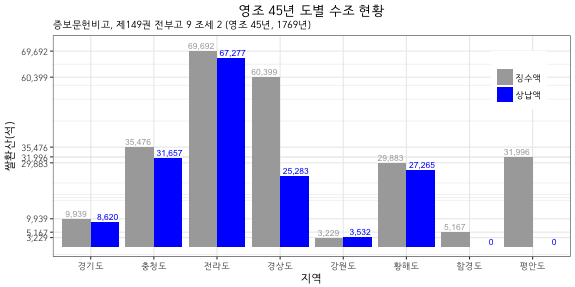

## Problem

1769년(영조 45년) 도별 수조 현황표를 막대그래프로 표시



## Data Setup

```{r, data}
library(extrafont)
province <- c("경기도", "충청도", "전라도", "경상도", "강원도", "황해도", "함경도", "평안도")
expected <- c(9939, 35476, 69692, 60399, 3229, 29883, 5167, 31996)
collected <- c(8620, 31657, 67277, 25283, 3532, 27265, 0, 0)
tax.df <- data.frame(province, expected, collected, stringsAsFactors = FALSE)
tax.df
```

## Barplot(R Base)

```{r, fig.width = 12, fig.height = 6}
library(extrafont)
par(family = "HCR Dotum LVT")
b1 <- barplot(t(as.matrix(tax.df[, 2:3])), 
        axes = FALSE, 
        ylim = c(0, 80000), 
        beside = TRUE, 
        names.arg = tax.df[, 1], 
        legend.text = c("징수액", "상납액"), col = c("darkgrey", "blue"))
# axis(side = 2, 
#     at = as.vector(as.matrix(rates.df[, 2:3])), 
#     labels =  as.vector(as.matrix(rates.df[, 2:3])), las = 1)
text(x = b1[1, ], y = expected + 2000, labels = format(expected, big.mark = ","), col = "black")
text(x = b1[2, ], y = collected + 2000, labels = format(collected, big.mark = ","), col = "black")
main.title <- "영조 45년 도별 수조 현황"
sub.title <- "증보문헌비고, 제149권 전부고 9 조세 2 (영조 45년, 1769년)"
main.text <- "쌀환산(석)\n상납비율은 약 66%"
title(main = main.title, sub = sub.title, cex.main = 2)
text(x = 18, y = 60000, main.text, cex = 1.6, adj = 0.5)
```

## ggplot

### Data for ggplot

```{r, data reshaping}
library(reshape2)
tax.df$province.f <- factor(province, levels = province)
tax.df
str(tax.df)
tax.df.melt <- melt(tax.df[, 2:4], 
                      id.vars = "province.f", 
                      measure.vars = c("expected", "collected"), 
                      variable.name = "tax", value.name = "amount")
tax.df.melt
str(tax.df.melt)
```

### Geom_bar

```{r, fig.width = 8, fig.height = 4}
library(ggplot2)
source("./theme_kr.R")
g0 <- ggplot(data = tax.df.melt, 
             mapping = aes(x = province.f, y = amount, fill = tax)) 
(g1 <- g0 + 
  geom_bar(stat = "identity", position = position_dodge())) 
# g1
g2 <- g1 +
  geom_text(mapping = aes(x = province.f, 
                          y = amount + 2000, 
                          label = format(amount, big.mark = ","),
                          colour = tax), 
            position = position_dodge(width = 1), 
            size = 3)
g2
g3 <- g2 +
  theme_bw() +
  theme.kr
g3
g4 <- g3 + 
    scale_fill_manual(name = "", 
                      values = c("darkgrey", "blue"), 
                      labels = c("징수액", "상납액")) +
    scale_colour_manual(name = "",
                        values = c("darkgrey", "blue"), 
                        labels = c("징수액", "상납액"))
g4
g5 <- g4 + 
    scale_x_discrete(name = "지역")
g5
g6 <- g5 +
    scale_y_continuous(name = "쌀환산(석)", 
                       breaks = as.vector(as.matrix(tax.df[, 2])), 
                       labels = format(as.vector(as.matrix(tax.df[, 2])), big.mark = ","))
g6
g7 <- g6 +
    labs(title = main.title, subtitle = sub.title)
g7
g8 <- g7 +
  theme(plot.title = element_text(hjust = 0.5), 
        plot.subtitle = element_text(family = "HCR Dotum LVT"),
        legend.position = c(0.9, 0.7))
g8
```
